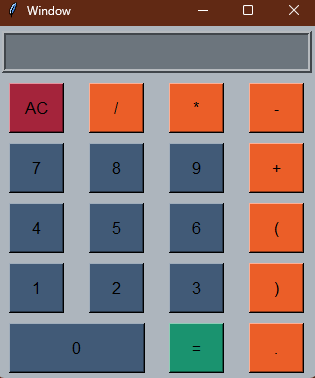

# Calculadora Básica en Python

Este proyecto es una calculadora básica implementada en Python con una interfaz de usuario amigable.

## Características

- **Operaciones básicas**: La calculadora puede realizar operaciones básicas como suma, resta, multiplicación y división.
- **Interfaz de usuario**: El programa cuenta con una interfaz de usuario intuitiva para facilitar la interacción.

## Estructura del Proyecto

El proyecto consta de los siguientes archivos:

- `calculator.py`: Este es el archivo principal que contiene todo el código de la calculadora.

## Requisitos

Para ejecutar este programa, necesitarás tener instalado Python en tu sistema. Puedes descargarlo desde la página oficial de Python.

## Licencia

Este proyecto está bajo la licencia MIT. Consulta el archivo `LICENSE` para obtener más detalles.

-----------------------------------------

# Basic Calculator in Python

This project is a basic calculator implemented in Python with a user-friendly interface.

## Features

- **Basic operations**: The calculator can perform basic operations such as addition, subtraction, multiplication, and division.
- **User interface**: The program has an intuitive user interface to facilitate interaction.

## Project Structure

The project consists of the following files:

- `calculator.py`: This is the main file that contains all the code for the calculator.

## Requirements

To run this program, you will need to have Python installed on your system. You can download it from the official Python page.

## License

This project is under the MIT license. Check the `LICENSE` file for more details.

-----------------------------------------

 

